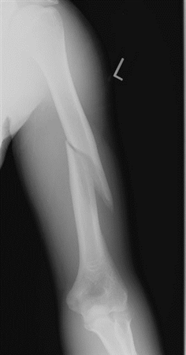
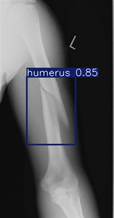

# 🦴 BoneSight AI

BoneSight AI is a lightweight, full-stack web application that detects bone fractures in X-ray images using a custom-trained YOLOv11 model. The frontend is built with HTML/CSS/JS and hosted on **Vercel**, while the FastAPI backend is hosted on **Render**.

---

## Features

-  Upload X-ray images of possible fractures
-  Real-time fracture detection using YOLOv11
-  Returns annotated image with bounding boxes

---

##  How It Works

1. The user uploads an image from the frontend.
2. The image is sent to the FastAPI backend via a POST request.
3. The backend:
   - Saves the image temporarily
   - Runs YOLOv11 prediction
   - Copies the annotated result to a static folder
4. The backend responds with the image URL.
5. The frontend displays the final result.

---

## 🛠 Technologies Used

### Frontend
- HTML, CSS, JavaScript
- Hosted on [Vercel](https://vercel.com/)

### Backend
- FastAPI + Python
- Ultralytics YOLOv11 (`ultralytics` package)
- Hosted on [Render](https://render.com/)

---

##  Example Result

> Upload an image like this:

> You'll get an output like this:

### Note

Because the host on [Render] is free, image requests made on the website might take some time to process due to the limited hardware resources of the virtual machine. If you try to process an image immediately after accessing the page and it takes too long, I recommend refreshing the page and trying again. Processing can take 1–2 minutes, so please be patient.